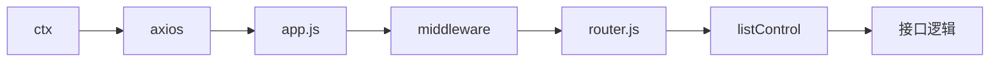

### 课堂知识点 

#### 1. 数据交互过程

#### 2. 接口内部逻辑

    a. 先获取前端传来的数据 ctx
    b. 跟数据库进行交互 
        查询 app.mysql.select('blog')
            app.mysql.query(`SELECT * FROM blog`)

        带条件查询 (精准匹配)
            app.mysql.select('blog',{where:{text:value}})
            app.mysql.query(`SELECT * FROM blog WHERE text='${value}'`)
        
        新增 app.mysql.insert('blog',{id:null,user:user,pwd:pwd})
            app.mysql.query(`INSERT INTO blog VALUES (id,user,pwd)`)
        
        修改 app.mysql.update('blog',{id:1,user:'234'})
            app.mysql.query(`UPDATE blog SET user="123" WHERE id ='1'`)
        
        删除 app.mysql.delete('blog',{id:1})
            app.mysql.query(`DELETE FROM blog WHERE id = '1'`)
    c. 一些数据处理逻辑
    d. 响应前端请求

    
